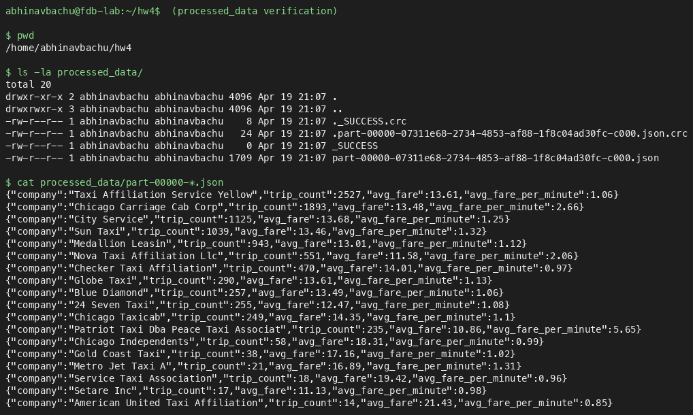

# CS498D HW4

NetID: `abach8`

## Live API

The Flask server is running on the GCP VM at:

```
http://136.115.86.160:5000
```

(see `HW4.txt`).

## Repository contents

| File | Purpose |
| --- | --- |
| `Team.txt` | NetID(s) |
| `HW4.txt` | External IP of the GCP VM (`<ip>:5000`) |
| `fdb_answers.txt` | Part 3 FoundationDB answers (Q1-Q5) |
| `Design.pdf` | Part 4 written analysis |
| `screenshots/processed_data.png` | Part 2.1 screenshot (referenced below) |
| `README.md` | This file |

## Endpoints exposed by the server

Part 1 (Neo4j):

- `GET /graph-summary`
- `GET /top-companies?n=<int>`
- `GET /high-fare-trips?area_id=<int>&min_fare=<float>`
- `GET /co-area-drivers?driver_id=<string>`
- `GET /avg-fare-by-company`

Part 2.2 (PySpark):

- `GET /area-stats?area_id=<int>`
- `GET /top-pickup-areas?n=<int>`
- `GET /company-compare?company1=<string>&company2=<string>`

## Part 2.1 Screenshot

`processed_data/` folder contents (including the `_SUCCESS` file) and the contents of one part file:


